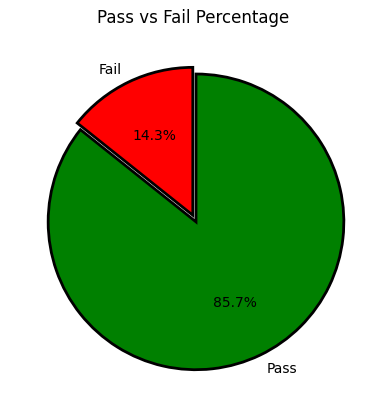
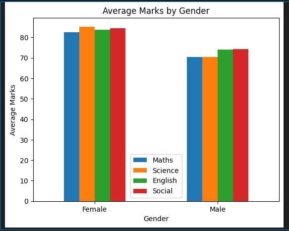

# 🎓 Academic Performance Insights

This project explores student academic performance using Python and basic data analysis techniques. It focuses on cleaning, transforming, and visualizing academic data to identify performance trends, gender-based differences, and grade classification.

---

## 📁 Project Structure

```
Academic_Performance_Insights/
│
├── Marks.csv                          # Student dataset
├── Academic_Performance_Insights.ipynb # Main Jupyter notebook with all analysis
├── Academic_Performance_Insights_Formatted.docx # Project documentation (Word)
├── README.md                          # GitHub summary file
└── images/                            # (Optional) Charts or screenshots
```

---

## 🛠️ Technologies Used

- **Language:** Python 3.x
- **Libraries:** pandas, matplotlib
- **IDE:** VS Code with Jupyter Notebook support
- **Version Control:** Git & GitHub

---

## ✅ Features

- Data import and cleaning (handling nulls, duplicates)
- Gender-based filtering (e.g., female students’ science marks)
- Student name queries (starts with, ends with)
- Grade classification based on total marks
- Pie chart showing pass/fail ratio
- Bar chart visualizing total marks
- Group-based subject performance

---

## 🚀 How to Run

1. Clone this repository or download the ZIP.
2. Open `Academic_Performance_Insights.ipynb` in Jupyter Notebook or VS Code.
3. Make sure `Marks.csv` is in the same folder.
4. Run the notebook cell by cell to see the insights and visuals.

---

## 📌 Screenshots

### 🎯 Pass vs Fail Pie Chart


### 📊 Total Marks Bar Chart


---

## 📄 Documentation

Full project documentation is available in `Academic_Performance_Insights_Formatted.docx`.

---

## 👩‍💻 Author

**Baby Swathi Ramisetti**  
Graduate Student, Golden Gate University  
Program: MS in Information Technology Management

---

## 🌐 GitHub

This project is version-controlled using Git and hosted on GitHub for transparency, tracking, and collaboration.
